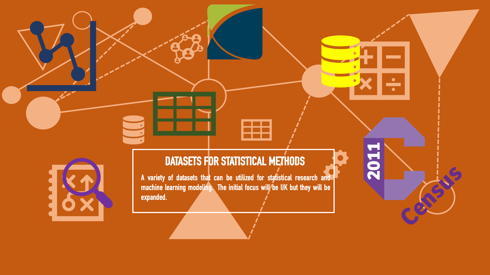

# Datasets for Machine Learning Models

What follows, is a list of datasets that can be utilised for a variety of statistical research tasks.

## 1. Demographic Data (2011 census population survey)

The data have been extracted from the NOMIS website (https://www.nomisweb.co.uk/) as of 13-Apr-2020.

The geographical level is local authority district (LAD).

The data have been saved in a .csv format.

A full breakdown of the 200+ variables can be found at the NOMIS data dictionary inside the `NOMIS` folder. 

The final dataset has been constructed from these ONS datasets:

* KS101EW - Usual resident population
* KS102EW - Age structure
* KS103EW - Marital and civil partnership status
* KS104EW - Living arrangements
* KS105EW - Household composition
* KS106EW - Vulnerable Households (65+, unemployed adults, dependent children, long term health problems)
* KS201EW - Ethnic group
* KS205EW - Passports held
* KS209EW - Religion
* KS301EW - Health and provision of unpaid care
* KS401EW - Dwellings, household spaces and accommodation type
* KS402EW - Tenure
* KS403EW - Rooms, bedrooms
* KS404EW - Car or van availability
* KS501EW - Qualifications and students
* KS601EW to KS603EW - Economic activity
* DC7101EWla - Method of travel to work
* UKMIG001 - Migration by sex by age
* DWP Benefits ([link](https://www.gov.uk/government/collections/dwp-statistical-summaries))
* Mortality and birth rates (Life Events)
* Index of Deprivation ([link](https://www.gov.uk/government/statistics/english-indices-of-deprivation-2019)): Caution is required since Wales and England values are NOT comparable.
* Annual Survey of Hours and Earnings
* 2011 Area Classification for Output Areas ([link](https://geogale.github.io/2011OAC/))
* Regional gross domestic product local authorities ([link](https://www.ons.gov.uk/economy/grossdomesticproductgdp/datasets/regionalgrossdomesticproductlocalauthorities))
* Regional gross value added (balanced) by industry: local authorities
* Family spending in the UK
* UK House Price Index ([link](https://www.gov.uk/government/statistical-data-sets/uk-house-price-index-data-downloads-february-2020))
* Household Expenditure: A6, A35 ([link](https://www.ons.gov.uk/peoplepopulationandcommunity/personalandhouseholdfinances/expenditure/bulletins/familyspendingintheuk/financialyearending2018))
* Insolvency Statistics ([link](https://www.gov.uk/government/statistics/individual-insolvencies-by-location-age-and-gender-england-and-wales-2018))
* Health Profiles ([link](https://fingertips.phe.org.uk/profile/health-profiles/data#page/0/gid/1938132696/pat/6/par/E12000003/ati/101/are/E08000016/cid/4/tbm/1/page-options/ovw-do-0))
* Business Activity ([link](https://www.ons.gov.uk/businessindustryandtrade/business/activitysizeandlocation/bulletins/ukbusinessactivitysizeandlocation/2019))

## 2. Table with information about commuting to work (Local Authority District Level)

The dataset has been extracted from NOMIS and from Department for Transport.

The main datasets that were used to extract the data are:
* WU01UK - Location of usual residence and place of work
* WU03UK - Location of usual residence and place of work by method of travel to work

Migration Inflows/Outflows table
* MM01CUK_ALL - Origin and destination of UK migrants (Inflows/Outflows)
* MM01CUK_NON_UK - Origin and destination of non-UK migrants (Inflows)

## 3. Datasets

Links for the datasets that were used to compile the output data:
1. [NOMIS 2011 demographic survey data](https://www.nomisweb.co.uk/): The data repository contains many information on various geographical levels showing demographic and social characteristics in England and Wales. The dataset also contains updated (2018-19) life events, migration data, trasportation data as well as hours and earnings surveys.
2. [DWP Benefits statistics](https://www.gov.uk/government/collections/dwp-statistical-summaries): The website contains number of people who claim benefits by geography and type of benefit. It is a good indicator to understand how deprived an area might be (as an alternative to Deprivation Index - IMD).
3. [Department of Transport](https://roadtraffic.dft.gov.uk/downloads): The data from DoT contain information regarding annual commuting within and between geographies and categorised by mean of transport. There is also an official DoT [GitHub](https://github.com/departmentfortransport/ds-data-sources) account that offers a list of various transportation datasets.
4. [Open Geography Portal](https://geoportal.statistics.gov.uk/): We used the OGP to link the different datasets together. Local administration areas in UK have changed boundries over time and OGP assists to link them together, as well as lookup tables for countries, Local Authority Districts, regions and parliamentary constituencies. 
5. [England Index of Multiple Deprivation - IMD](https://www.gov.uk/government/statistics/english-indices-of-deprivation-2019): The dataset is focussing on national and sub-national patterns of multiple deprivation, patterns ofincome andemployment deprivation andsome analysis  of the  supplementaryIncome  Deprivation  Affecting  Children  Index  (IDACI)  and  Income Deprivation Affecting Older People Index (IDAOPI). 
6. [Wales Index of Multiple Deprivation - WIMD ](https://statswales.gov.wales/Catalogue/Community-Safety-and-Social-Inclusion/Welsh-Index-of-Multiple-Deprivation/WIMD-2019): The Wales equivalent IMD, the scores and ranks are not to be compared with the England IMD. The reason is that the values are based on different metrics and are not standardised. 
7. [Consumer Research Data Centre](https://public.cdrc.ac.uk/): It contains various consumer and population datasets and surveys for UK. We used the Wales equivalent IMD from CRDC in combination with the official WIMD website in order to produce the final output. The reason is that CRDC contains scores whereas WIMD contains Local Authority level and ranks.
8. [Output Area Classification](http://www.opengeodemographics.com/): OAC is a UK persona geodemographic built partnership with the ONS and is created entirely from the 2011 census data. There are 8 main personas attributed down to postcode level. There is an ONS [page](https://www.ons.gov.uk/methodology/geography/geographicalproducts/areaclassifications/2011areaclassifications) website and a GitHub [page](https://geogale.github.io/2011OAC/) that contains the datasets.

## 4. Social Interaction Matrix (SIM)

Social mixing patterns are crucial in driving transmission of infectious diseases and informing
public health interventions to contain their spread.  Age-specific social mixing is often inferred
from surveys of self-recorded contacts which by design often have a very limited number of par-
ticipants.  In addition, such surveys are rare, so public health interventions are often evaluated
by considering only one such study. These  matrices  are highly relevant for informing prevention and control of new outbreaks, and evaluating strategies that reduce the amount of mixing in the population (such as school closures, social distancing, or working from home).  In addition, they finally provide the possibility to use multiple sources
of social mixing data to evaluate the uncertainty that stems from social mixing when designing
public health interventions (From Abstract, [Klepac et al.](https://www.medrxiv.org/content/10.1101/2020.02.16.20023754v2)).

1. [Klepac et al.](https://www.medrxiv.org/content/10.1101/2020.02.16.20023754v2) In this paper Klepac et al. report detailed population contact patterns for United Kingdom based self-reported contact data from over 36,000 volunteers that participated in the massive citizen science project BBC Pandemic. The amount of data collected allows us generate fine-scale age-specific population contact matrices by context (home, work, school, other)  and  type  (conversational  or  physical)  of  contact  that  took  place (From Abstract). 

2. [Prem et al.]( https://doi.org/10.1371/journal.pcbi.1005697) Data from population-based contact diaries in eight European countries from the POLYMOD study were projected to 144 other countries using a Bayesian hierarchical model that estimated the proclivity of age-and-location-specific contact patterns for the countries, using Markov chain Monte Carlo simulation. Household level data from the Demographic and Health Surveys for nine lower-income countries and socio-demographic factors from several on-line databases for 152 countries were used to quantify similarity of countries to estimate contact patterns in the home, work, school and other locations for countries for which no contact data are available, accounting for demographic structure, household structure where known, and a variety of metrics including workforce participation and school enrolment (From Abstract). Further supporting documents: [Supporting Information](https://journals.plos.org/ploscompbiol/article/file?id=10.1371/journal.pcbi.1005697.s001&type=supplementary)

3. [Fumanelli et al.]( https://doi.org/10.1371/journal.pcbi.1002673) The authors present the modeling of the population of 26 European countries and the generation of the corresponding synthetic contact matrices among the population age groups. The method is validated by a detailed comparison with the matrices obtained in six European countries by the most extensive survey study on mixing patterns (From Abstract).

4. [Wagner](https://www.cc.gatech.edu/~alanwags/pubs/hri196-wagner.pdf) This   paper   explores   the   use   of   an   outcome   matrix   as   a computational  representation  of  social  interaction suitable  for implementation  on  a  robot.  An  outcome  matrix  expresses  the reward  afforded  to  each  interacting  individual  with  respect  to pairs  of  potential  behaviors.  We  detail  the  use  of the  outcome matrix as a representation of interaction in social psychology and game theory, discuss the need for modeling the robot’s interactive partner, and contribute an algorithm for creating outcome matrices from perceptual information. Experimental results explore the use of  the  algorithm  with  different  types  of  partners  and  in  different environments (From Abstract).

5. [POLYMOD](http://www.socialcontactdata.org/) The survey has been organised and presented by Mossong et al. in 2007 - 2008 period. Is the standard social matrix that is being used for infectious deceases. There is a R Shiny version where the user can easily download the relevant data by gender and other characteristics ([RShiny](https://lwillem.shinyapps.io/socrates_rshiny/))

6. [Social contact data for UK](https://zenodo.org/record/1409507#.XpZj2W57l24)

## 5. Mobility Reports

### Google AI

Google AI and Google Health have made public their mobility data gathered across 140 countries. Specifically, for UK we have at local authority level information for the following ([Github](https://github.com/datasciencecampus/google-mobility-reports-data))

1. Grocery & pharmacy
2. Parks
3. Residential
4. Retail & recreation
5. Transit stations
6. Workplace

### Apple Mobility Reports

Apple has also made public the mobility reports (on a higher level than Google though) based on iPhone users.

Data source is the special Apple COVID [website](https://www.apple.com/covid19/mobility)

## 6. R Library for SIM

[socialmixr](https://rdrr.io/cran/socialmixr/f/vignettes/introduction.Rmd) is an R package to derive social mixing matrices from survey data. These are particularly useful for age-structured infectious disease models. For background on age-specific mixing matrices and what data inform them, see, for example, the paper on by [Mossong et al.](https://journals.plos.org/plosmedicine/article?id=10.1371/journal.pmed.0050074)

## 7. COVID UK focused Data

The ONS offers LAD level data, [link](https://coronavirus.data.gov.uk/#category=ltlas&map=rate). This is what has been used.

The Local Government Association includes detailed daily data fro COVID-19 cases in UK. Numbers of cases are collated by Public Health England. Case data is based on the home address of cases reported to PHE by diagnostic laboratories and matched to ONS administrative geography codes and names to generate geographic case counts. The data can be found [here](https://lginform.local.gov.uk/reports/view/lga-research/covid-19-case-tracker). The data are saved inside the COVID-19 folder and the Local Authority Association subfolder.

The data include information on E06, E08, E09 and E10 levels ($n=151$ administrative regions). In other words, they include Unitary Authorities, Metropolitan Districts, London Boroughs and Counties but not the Non-metropolitan Districts. All the previous, including the Non-metropolitan Districts constitute the LAD ($n=343$) that the NOMIS data is based on. For more information check the [ONS Geoportal](https://geoportal.statistics.gov.uk/datasets/register-of-geographic-codes-june-2019-for-the-united-kingdom).

